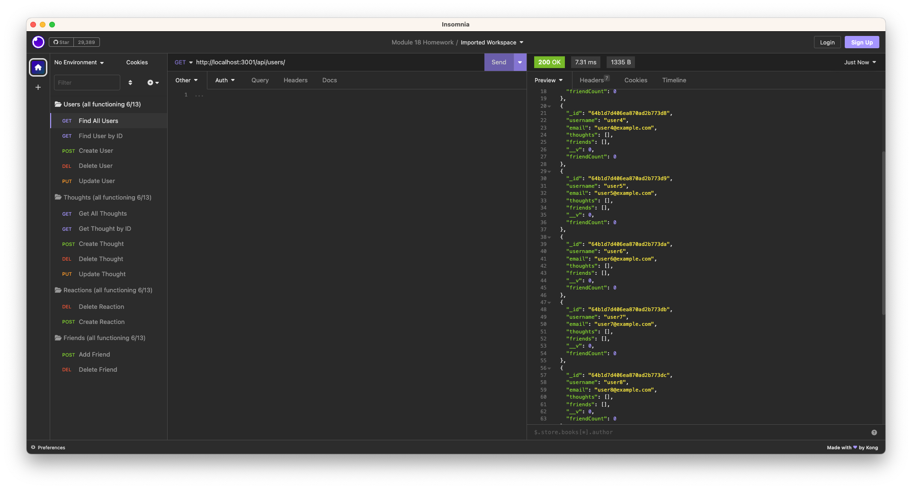

# nosql-social-network

## Description

The purpose of this assignment was to create a NoSQL database using mongoDB to build a social network API. The database exists as a group of users that can create posts, or "thoughts". Other users can react to these thoughts with "reactions". Users can also add other users as friends.

## Installation

to install, clone the repo or download it as a zip file. Install dependencies with `npm i`. _(note: you must have mongoDB installed on your machine to run this application)_

Start the server with `npm start`, then use Insomnia to test the routes. If you would like dummy user data, run `npm run seed` to seed the database after starting the server.

## Usage

A video walkthrough is available [here.](https://drive.google.com/file/d/1bERVJnoMMkp8lEJEi30FARLFNARm_Kdf/view)

I realize that it is July, ignore the typo in all of the Insomnia folders.

## License

## Credits

* GPT was utilized to build the seed script - it is not my own code!
* Insomnia routes were provided by the instructional staff
* All other code is my own
